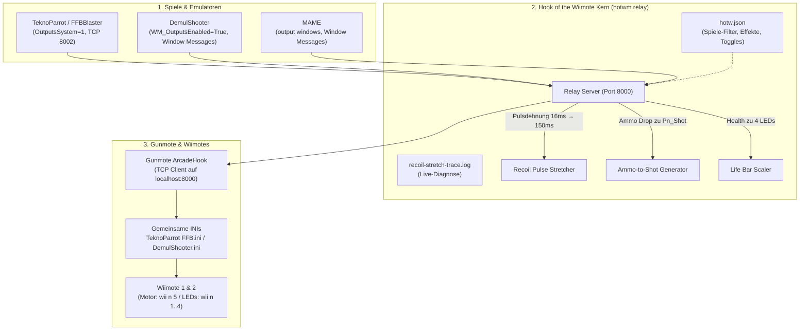

# frieds-hotwm — Hook of the Wiimote 🎯🎮

> **Eigenständiges Haptik- & LED-Relay für Gunmote und Wiimotes (Standalone & Kit-Integration)**

[](LICENSE)
[](https://microsoft.com/windows)
[](https://microsoft.com/powershell)
[](https://python.org)

[English Documentation](README.md) | **Deutsche Dokumentation**

---

## 🎯 Über das Projekt

**Hook of the Wiimote (`hotwm`)** ist ein anfängerfreundliches, transparentes Setup- und Relay-Tool für Arcade-Lightgun-Enthusiasten. Es ermöglicht vollwertiges Haptik-Feedback für Wiimotes hinter **Gunmote**:
- 💥 **Schuss- und Treffer-Rumble:** Intelligente Pulsdehnung (16ms → 150ms), damit der mechanische Vibrationsmotor der Wiimote spürbar anläuft.
- 🚦 **Dynamische Lebensanzeige:** Visualisierung des Spieler-Gesundheitszustands über die 4 Wiimote-Player-LEDs.
- 🔄 **Ammo-Drop zu Schuss:** Automatisches Auslösen von Haptik bei Munitionsverlust (für Spiele ohne explizite Force-Feedback-Events).
- 🕹️ **Multi-Plattform-Support:** Nahtlose Integration mit **TeknoParrot / FFBBlaster**, **DemulShooter** und **MAME**.

Entwickelt sowohl als **tragbares Standalone-Tool** für bestehende RetroBat-, TeknoParrot- und MAME-Setups als auch als nativer Baustein für das [*Fried's Retrogaming Kit*](https://github.com/kburna243/frieds-retrogaming-kit).

---

## 🏗️ Architektur



---

## 🖥️ Standalone WPF Dashboard

Das Dashboard bietet eine intuitive grafische Oberfläche für Hardware-Status, Haptik-Tests, Tuning und Live-Logüberwachung:

- **1-Klick Start:** Doppelklick auf `Start-HotwmDashboard.bat` (oder `.\gui\HotwmDashboard.ps1`).
- **Hardware-Ampeln:** Echtzeit-Status von Relay, Gunmote-Prozess, ViGEmBus-Treiber, Wiimotes / DolphinBar und Kit-API.
- **Haptik-Testbench:** Direkte Test-Buttons für Player 1 & 2 Recoil Kick (150ms) und LED-Sequenzen (1–4) ohne Spielstart.
- **Echtzeit-Tuning:** Recoil-Stretch-Schieberegler (80–300 ms), Toggles für Ammo-Drop-Kick und LED-Lebensbalken, sowie Per-Game-Profile. Änderungen werden direkt in `hotw.json` gespeichert und im laufenden Relay **in unter 1 Sekunde hot-reloaded**.
- **Live-Log:** Eingebetteter Stream von MAMEOutput-Events und Recoil-Impulsen.
- **Cabinet Integration:** Direkter Statusabgleich mit dem *Fried's Retrogaming Kit* (Input-Matrix v1.3+ und Output-Sicherheitsprüfungen).

---

## 🛠️ Schnellstart & Installation

### Voraussetzungen
1. **Windows 10 oder 11 (64-Bit)**
2. **Python 3.10+** (im System-PATH vorhanden)
3. **Gunmote** mit geladener ArcadeHook-DLL
4. **Bluetooth** (integriert oder DolphinBar) mit gekoppelten Wiimotes

### Installation als Hintergrund-Dienst
Um das Relay automatisch beim Windows-Login zu starten:
```powershell
.\tools\Install-HotwmTask.ps1
```
Zum Entfernen:
```powershell
.\tools\Uninstall-HotwmTask.ps1
```

### Standalone-Paket bauen
Um ein portables Distributions-ZIP zu erstellen:
```powershell
.\tools\Build-HotwmPackage.ps1
```
Das fertige Paket liegt anschließend unter `dist/frieds-hotwm-v<version>.zip`.

---

## ⚙️ Konfiguration (`config/hotw.json`)

```json
{
  "global": {
    "hold_ms": 150,
    "ammo_drop_shot": true,
    "led_mode": "life_bar",
    "trace_enabled": false
  },
  "games": {
    "Rambo": { "rumble": true, "leds": true },
    "2spicy": { "rumble": true, "leds": true },
    "hotd4": { "rumble": true, "leds": true },
    "la_machineguns": { "rumble": true, "leds": false }
  }
}
```

---

## 🚀 Meilensteine & Roadmap

1. **Phase 1: Kern-Relay Verankerung** ✅ *(Abgeschlossen)*
   - TCP-Server (Port 8000 für Gunmote, Port 8002 für FFBBlaster)
   - Win32-Message-Loop für DemulShooter & MAME
   - Optimierter Output-Adapter mit Pulsdehnung (16ms → 150ms) und Ammo-Drop-Trigger
2. **Phase 2: Konfigurations- & Filter-Engine (`hotw.json`)** ✅ *(Abgeschlossen)*
   - 14 vorkonfigurierte Spieleprofile und Haptik-Toggles (Rumble / LEDs)
   - Sofort-Test-Trigger per Socket (`--test-p1-rumble`, `--test-p1-leds`, `tools\Test-HotwmHaptics.ps1`)
   - Kit-API-Contract v1.6 Pinned Snapshot & Drift-Prüfung
3. **Phase 3: Windows-Automatisierung & Tools** ✅ *(Abgeschlossen)*
   - Hintergrund-Task `Gunmote Recoil Stretch` (`Install-HotwmTask.ps1` / `Uninstall-HotwmTask.ps1`)
   - KitClient für nahtlose Abfrage der Kit-Operation `outputs.wiimote_hook`
4. **Phase 4: Grafische Benutzeroberfläche (WPF-Dashboard)** ✅ *(Abgeschlossen)*
   - `gui/HotwmDashboard.ps1` & `HotwmDashboard.xaml` mit Arcade Dark Theme
   - Status-Ampel für alle Komponenten, Haptik-Testbench, Live-Tuning und Log-Monitor
   - 1-Klick-Starter `Start-HotwmDashboard.bat`
5. **Phase 5: Eigenständiges Standalone-Paket & Release** ✅ *(Abgeschlossen)*
   - Portable Distribution (`Build-HotwmPackage.ps1` → ZIP-Release)
   - Zweisprachige Dokumentation (`README.de.md` & `README.md`)

---

## 📜 Lizenz

MIT License — Copyright (c) 2026 Friedrich Börner
