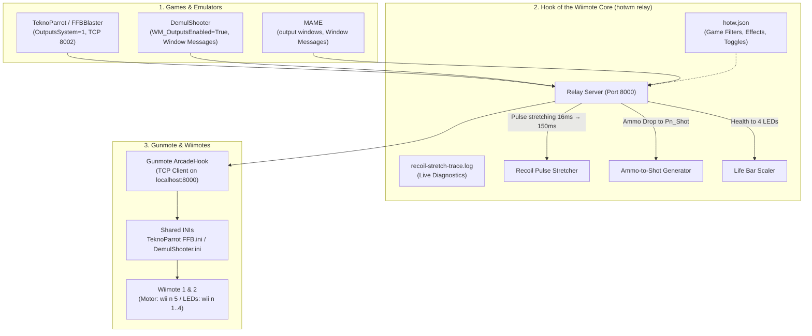

# frieds-hotwm — Hook of the Wiimote 🎯🎮

> **Standalone & Kit-Ready Recoil Rumble & LED Haptics Relay for Gunmote and Wiimotes**

[](LICENSE)
[](https://microsoft.com/windows)
[](https://microsoft.com/powershell)
[](https://python.org)

**English Documentation** | [Deutsche Dokumentation](README.de.md)

---

## 🎯 About The Project

**Hook of the Wiimote (`hotwm`)** is a beginner-friendly, transparent setup and relay tool for arcade lightgun enthusiasts. It brings full haptic feedback to Wiimotes operated behind **Gunmote**:
- 💥 **Shot and Hit Rumble:** Intelligent pulse stretching (16ms → 150ms) so the Wiimote's mechanical vibration motor has time to spin up and produce a tactile kick.
- 🚦 **Dynamic Health Indicators:** Visualizes player health levels via the 4 Wiimote player LEDs.
- 🔄 **Ammo-Drop to Shot Haptics:** Automatically triggers recoil rumble on ammo decrements for titles lacking explicit force-feedback events.
- 🕹️ **Multi-Platform Support:** Seamless integration with **TeknoParrot / FFBBlaster**, **DemulShooter**, and **MAME**.

Designed both as a **portable standalone tool** for existing RetroBat, TeknoParrot, and MAME installations, and as a first-class module for [*Fried's Retrogaming Kit*](https://github.com/kburna243/frieds-retrogaming-kit).

---

## 🏗️ Architecture



---

## 🖥️ Standalone WPF Dashboard

The dashboard provides an intuitive arcade-style interface for hardware status, haptics testing, tuning, and live log monitoring:

- **1-Click Launch:** Double-click `Start-HotwmDashboard.bat` (or run `.\gui\HotwmDashboard.ps1`).
- **Hardware Health Indicators:** Real-time status lights for the Relay, Gunmote process, ViGEmBus driver, Wiimotes / DolphinBar, and Kit API.
- **Haptics Test Bench:** Dedicated test buttons for Player 1 & 2 Recoil Kick (150ms) and LED light patterns without launching any game.
- **Real-Time Tuning:** Recoil-stretch slider (80–300 ms), toggles for ammo-drop kick and LED life bar, and per-game overrides. Changes are saved directly to `hotw.json` and **hot-reloaded by the running relay in under 1 second**.
- **Live Log:** Embedded stream of MAMEOutput events and recoil pulses.
- **Cabinet Integration:** One-click verification against *Fried's Retrogaming Kit* (Input Matrix v1.3+ and Output Safety audit).

---

## 🛠️ Quick Start & Setup

### Prerequisites
1. **Windows 10 or 11 (64-Bit)**
2. **Python 3.10+** (in system PATH)
3. **Gunmote** with loaded ArcadeHook DLL
4. **Bluetooth** (integrated or DolphinBar) with paired Wiimotes

### Background Service Installation
To automatically launch the relay on Windows login:
```powershell
.\tools\Install-HotwmTask.ps1
```
To remove the background task:
```powershell
.\tools\Uninstall-HotwmTask.ps1
```

### Building the Standalone Package
To build a portable release ZIP package:
```powershell
.\tools\Build-HotwmPackage.ps1
```
The resulting archive will be placed in `dist/frieds-hotwm-v<version>.zip`.

---

## ⚙️ Configuration (`config/hotw.json`)

```json
{
  "global": {
    "hold_ms": 150,
    "ammo_drop_shot": true,
    "led_mode": "life_bar",
    "trace_enabled": false
  },
  "games": {
    "Rambo": { "rumble": true, "leds": true },
    "2spicy": { "rumble": true, "leds": true },
    "hotd4": { "rumble": true, "leds": true },
    "la_machineguns": { "rumble": true, "leds": false }
  }
}
```

---

## 🚀 Milestones & Status

1. **Phase 1: Core Relay Anchor** ✅ *(Completed)*
   - Dual-channel TCP server (Port 8000 for Gunmote, Port 8002 for FFBBlaster)
   - Win32 Message Loop for DemulShooter & MAME
   - Pulse stretcher (16ms → 150ms) and ammo-decrement trigger
2. **Phase 2: Configuration & Filter Engine (`hotw.json`)** ✅ *(Completed)*
   - 14 preconfigured game profiles and haptic toggles (rumble / LEDs)
   - Instant socket test triggers (`--test-p1-rumble`, `--test-p1-leds`, `tools\Test-HotwmHaptics.ps1`)
   - Kit API Contract v1.5 pinned snapshot & automated drift check
3. **Phase 3: Windows Automation & Diagnostics** ✅ *(Completed)*
   - Background task `Gunmote Recoil Stretch` (`Install-HotwmTask.ps1` / `Uninstall-HotwmTask.ps1`)
   - KitClient for querying Kit operation `outputs.wiimote_hook`
4. **Phase 4: Graphical User Interface (WPF Dashboard)** ✅ *(Completed)*
   - `gui/HotwmDashboard.ps1` & `HotwmDashboard.xaml` with Arcade Dark Theme
   - Health lights for all components, haptics test bench, live tuning, and log monitor
   - 1-click launcher `Start-HotwmDashboard.bat`
5. **Phase 5: Portable Standalone Packaging & Release** ✅ *(Completed)*
   - Portable packaging script (`Build-HotwmPackage.ps1` → ZIP distribution)
   - Dual-language documentation (`README.de.md` & `README.md`)

---

## 📜 License

MIT License — Copyright (c) 2026 Friedrich Börner
